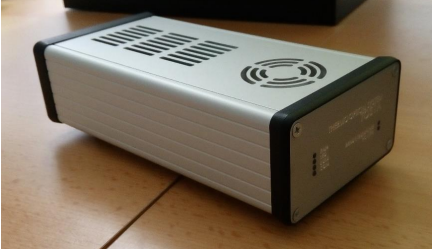
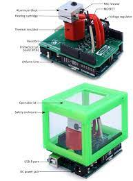
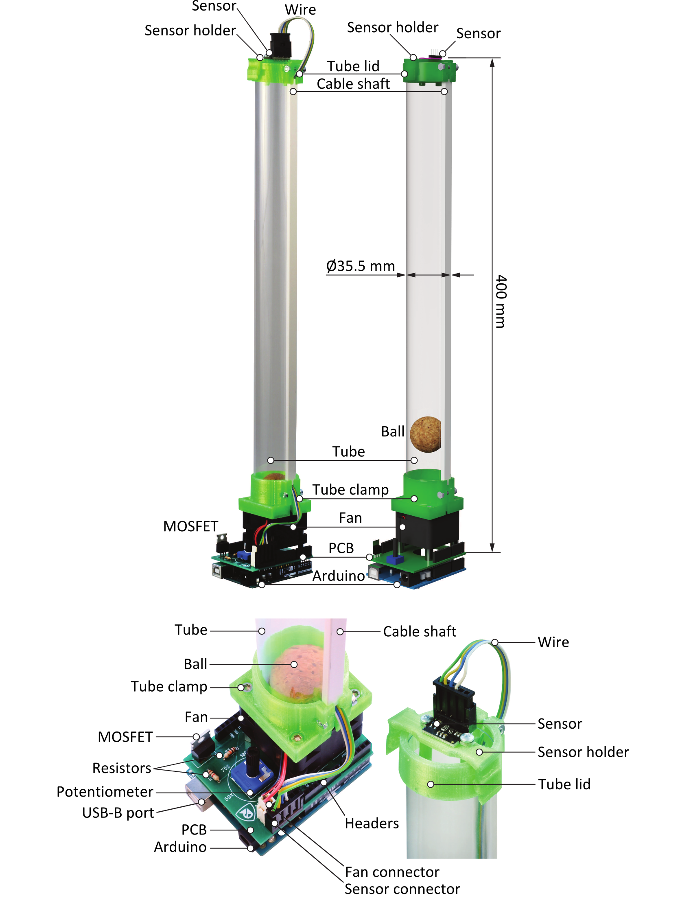
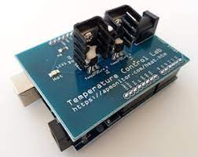
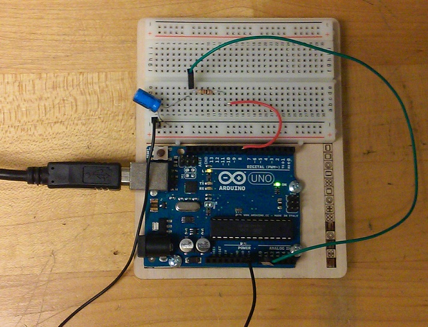

# pysimCoder-examples

This git should contains examples provided by users for different targets

## Examples for TOS1A (successor of uDAQ28/LT)

- https://www.eas.sk/mod/product/show.php?ID=16 (in Slovak language)

## Examples for Arduino Firmata

### Heatshield

- https://github.com/gergelytakacs/AutomationShield/wiki/HeatShield

### Floatshield

- https://github.com/gergelytakacs/AutomationShield/wiki/FloatShield

### TCLab

- http://apmonitor.com/pdc/index.php/Main/ArduinoTemperatureControl

### Resisotr-Capactior (RC) Circuit

- https://ctms.engin.umich.edu/CTMS/index.php?aux=Activities_RCcircuitA

